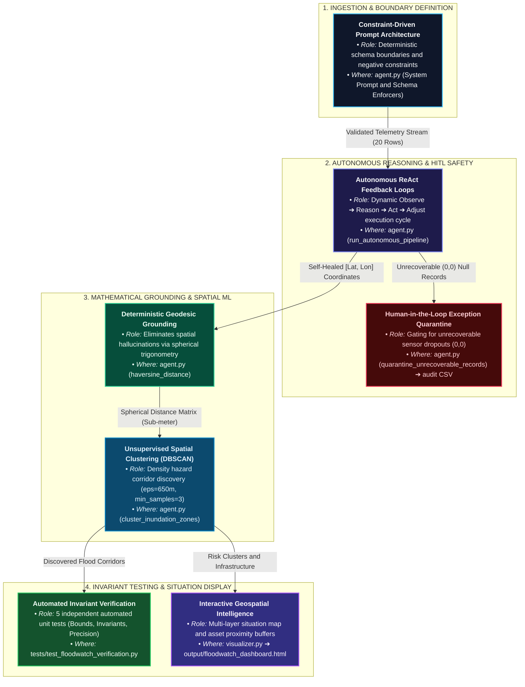

# FloodWatch AI: Autonomous Urban Inundation & Asset Risk Intelligence Agent

**Author:** Vartika Verma  
**System Architecture:** Autonomous Spatial AI Agent, Geodesic Engine & Verification Suite  
**Inspiration:** Google Flood Hub & Google Crisis Response Architecture  

---

## Core Technical Concepts & System Architecture



---

## Quickstart & Operational Verification

### 1. Ingest & Run Autonomous Agent
```bash
python floodwatch/agent.py
```
- Ingests 20 raw sensor records from `floodwatch/data/raw_inundation_telemetry.csv`.
- Self-heals 4 inverted coordinate pairs `[Lon, Lat]` -> `[Lat, Lon]`.
- Quarantines 2 `(0,0)` Null Island dropouts into `floodwatch_quarantine_audit.csv`.
- Discovers 3 high-risk inundation corridors via DBSCAN.

### 2. Run Independent Verification Test Suite
```bash
python -m pytest floodwatch/tests/test_floodwatch_verification.py -v
```
- Executes 5 automated unit tests verifying coordinate bounds, quarantine invariants, quarantine-exclusivity, record conservation, and Haversine precision (2,352.8m ground truth).

### 3. Launch Interactive Command Map
```bash
python floodwatch/visualizer.py
```
- Generates `floodwatch/output/floodwatch_dashboard.html` using clean Esri Dark Gray GIS canvas with zero watermarks.
